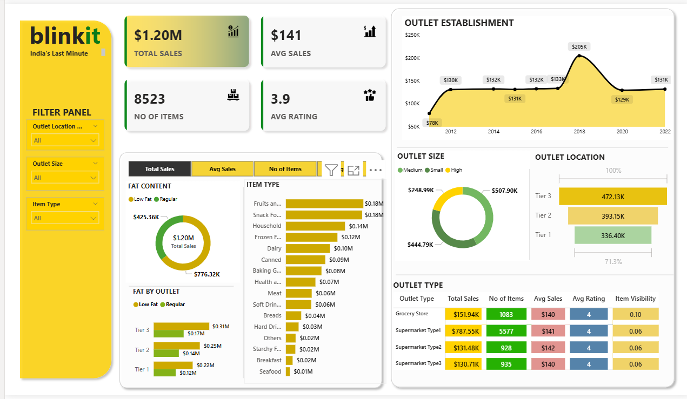

# 📊 Blinkit Sales and Outlet Performance Analysis

This project is an **interactive Power BI dashboard** that analyzes **Blinkit grocery sales, outlet KPIs, and product trends** to deliver **business intelligence insights**.

---

## 📌 Overview

- Visualizes key performance metrics of Blinkit grocery data  
- Provides detailed analysis by:
  - Outlet type, size, and location  
  - Item type and fat content  
  - Total sales, average sales, number of items, and average ratings  
- Helps identify top-performing outlets and products  
- Built with interactive filters, slicers, and visuals for easy exploration

---

## 🧩 Tools Used

- **Power BI** — for building the dashboard  
- **Microsoft Excel / CSV** — as the data source

---

## 🖼 Dashboard Screenshot

---

## 🚀 Key Insights

- 📈 Highest total sales from **Supermarket Type1** outlets  
- 📊 Outlet size **Medium** and **High** contribute most to sales  
- 🥇 Tier 3 outlets generate the highest revenue among locations  
- 🍏 Fruits & Vegetables, Snack Foods, and Frozen Foods are top-selling categories

---

## 📬 Author

**Lakshmi Roshini Kotha**  
📧 [lakshmiroshinikotha@gmail.com](mailto:lakshmiroshinikotha@gmail.com)  
🌐 [LinkedIn](https://www.linkedin.com/in/roshini-kotha) • [GitHub](https://github.com/lakshmiroshinikotha)
